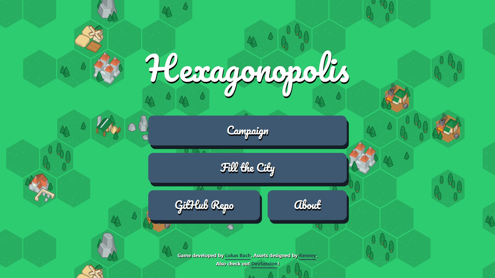
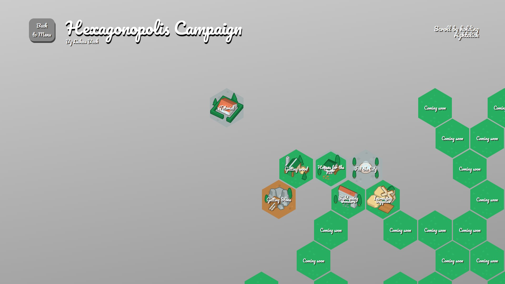
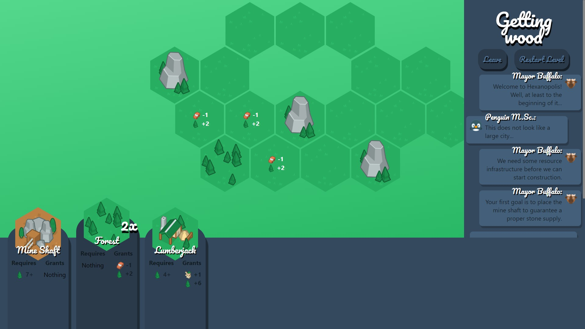
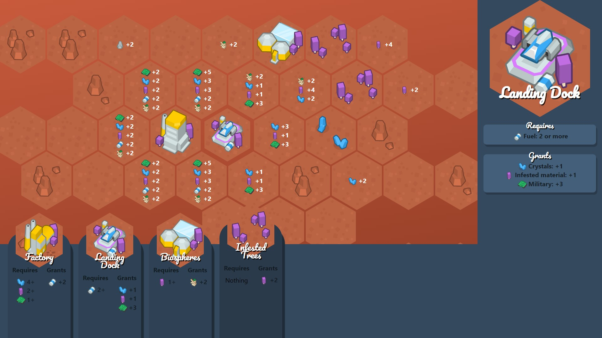

# Hexagonopolis

Hexagonopolis is a web-based minigame playable at 
[lukasbach.github.io/hexagonopolis](https://lukasbach.github.io/hexagonopolis).
It was developed using React and Typescript, the assets are designed
by [Kenney](https://kenney.nl).

The used asset packs are: 

 * [Hexagon Pack](https://kenney.nl/assets/hexagon-pack)
 * [Animal Pack Redux](https://www.kenney.nl/assets/animal-pack-redux)

## Screenshots

## ToDos

The game is playable, but lacks a few features, especially levels. At the moment,
there are a few campaign levels and three Fill-The-Map levels which are essentially
random-based levels. The balancing is also not so great at the moment.

Other missing features (which may or may not be added later) include:

 * Locking later campaign levels and unlocking them when the previous level is finished.
 * Animated dialogs.
 * Allow playing levels and campaigns designed by community (which should not be too hard,
   all levels are just JSON-data, just the logic to load external levels is missing).
 * Level Editor

## Developing and Deploying

If you want to download and run the game locally, you can
do so by following the usual npm/yarn workflow, ``yarn && yarn start``
to run the game and ``yarn && yarn run build`` to build independent
deployment artifacts.

The webapp was created using ``create-react-app`` and still uses
``react-scripts`` for building the app.

    
